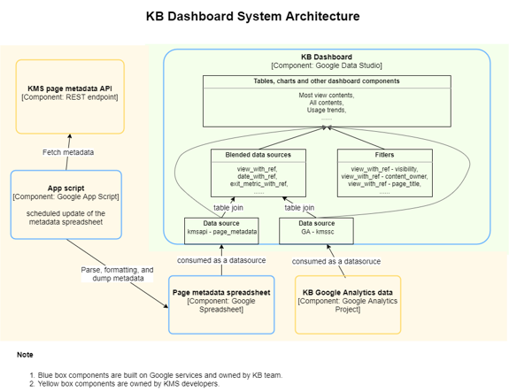

# Website Usage Dashboard of *Indiana University Knowledge Base*

### 1. Summary

- Motivation: working result at UITS, Indiana University Bloomington. 

- Participant: individual development.

- Task type: dashboarding.

- Topic: Google Analytics.

- Technologies: 

  - **Google Data Studio** - a web-based data visualization and reporting tool. Data reports are created in browser and sharing to the user through URL link. 

  - **Goggle App Script (Javascript)** - a programmable interface of Google products.  In this project, I wrote javascript code to build a data processing pipeline on Google Spreadsheet.

### 2. Introduction

[KB Dashboard](https://datastudio.google.com/u/0/reporting/1-L-U-sZUb5XXmHi4oEhGIF4sIzFNnETO/page/Clw5) is a website usage dashboard of [Indiana University Knowledge Base](https://kb.iu.edu/) domain. The dashboard and an [explaining document](https://kb.iu.edu/d/bdln) are open to the general public access. The website usage data are collected and imported from the correspondent Google Analytics account. 

As showed in the system architecture graph, the dashboard applies many functionality of Google Data Board, such as data blending (essentially "left join" in database system), calculated fields, and data filtering, to achieve current dashboard features. 

The publish of KB dashboard greatly helps the internal users (i.e., users of Indiana University) to access to the previous inaccessible Google Analytics data and to find out how their contents perform through self-service. On the other hand, it also frees the staff's of Indiana University Knowledge Base the burden of recurrently providing web usage data to the countless content providers, directives and leaderships. The dashboard is a great example that how business intelligence technologies and improve the productivity and knowledge spread through the organization. 