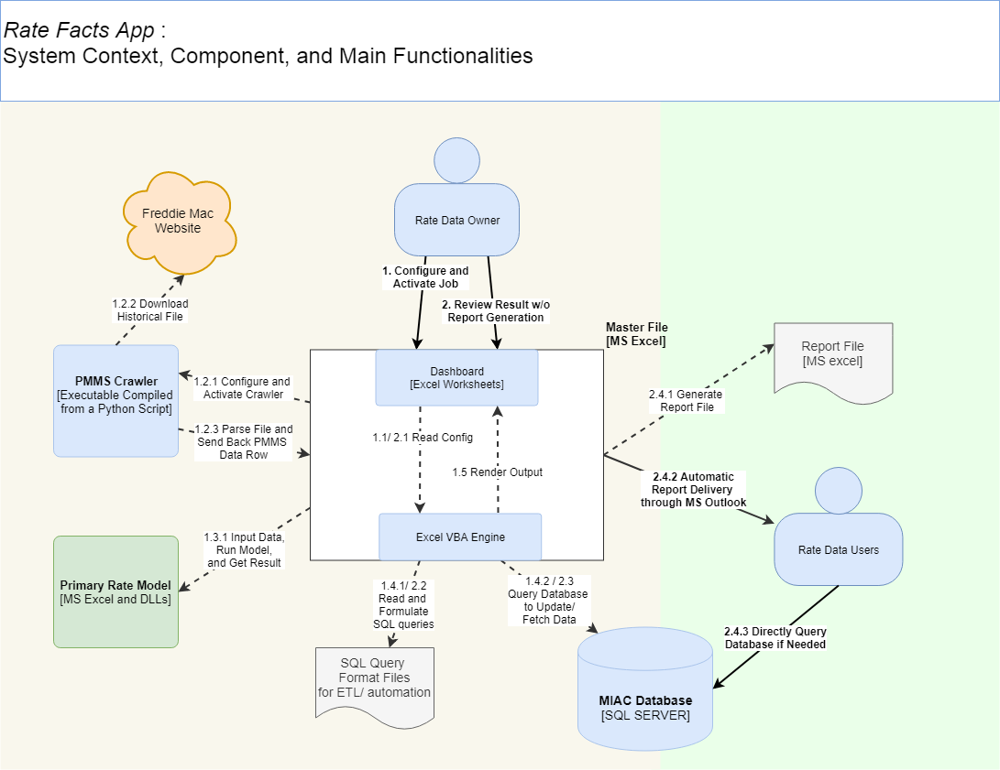

# RateFacts MS Excel app

### 1. Summary

- Motivation: working result at Mr. Cooper.
- Task type: dashboarding, automation. 
- Topic: financial data. 
- Technologies: 
  - **Python 3.6**  with following packages:
    - Request - make HTTP request
    - BeautifulSoup4 - pars webpage content
    - xlwings - interaction with MS Excel
    - pyinstaller - compile python script to executable
  - **VBA** - drive all steps of data processing, including config reading, SQL statement formation, query result rendering, and report document output. 
  - **SQL template** - SQL statement that accept dynamic variable assignment on runtime. 

### 2. Introduction

#### The aim of the system

Most of businesses Mr. Cooper operates are deeply connected to the dynamic of the mortgage market, especially the *interest rate dynamics*. In order to incorporate interest rate dynamics into decision-making process, Mr. Cooper has introduced a number of systems to collect and to process rate data. The aim of RateFacts MS Excel App is to simplify and to accelerate the business process in Mr. Cooper to producing and utilizing interest rate data. By providing powerful automation functionalities with an intuitive, easy-to-use user interface, Rate Facts MS Excel App enable users to accomplish routine interest rate data task, including maintaining, retrieving, and reporting the rate data in a lightening way and effortlessly. 

#### System architecture

The core component of the RateFacts is a MS Excel file, i.e., the Masterfile. Masterfile simultaneously work as the user interface and drives the backend data processing sequence. The typical working process of the Masterfile is:

1. read users' job configuration from an Excel sheet. 
2. execute data job and drive the working of other system component. The component can be:
3. - database engine and database tables
   - data model embedded in other Excel files 
   - SQL script text files
   - MS outlook 

3. render the job execution result back to the Masterfile. 

#### Result

Compared with the previous manual procedure to prepare daily interest rate report, RateFacts App has achieved the following improvement:

- **Easy-to-use**. Provide an unified user interface for users to configure, activate, review, and report the result of routine data job. Data flow between systems are coordinated automatically. No need for manual data manipulation.
- **Error-proof**: A well-designed, robust ETL process ensures 99% data integrity. All data are saved to database, meaning no more file/version management.
- **Time-saving**: Save 90% of processing time. Take only 2 minutes to finish all the required procedure when producing daily interest rate report, including human intervention of job configuration and result check  . 

